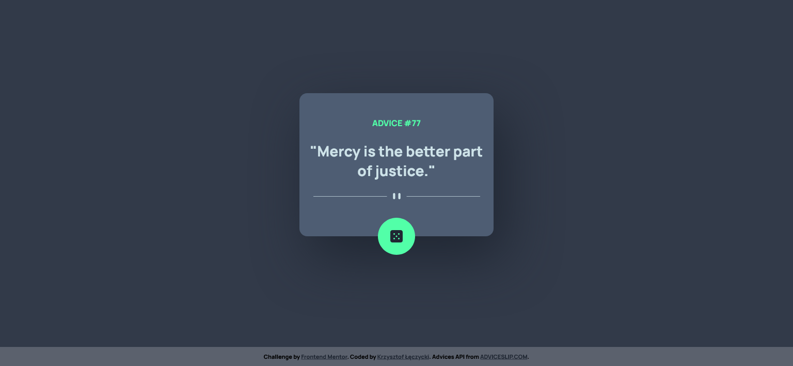

# Frontend Mentor - Advice generator app solution

This is a solution to the [Advice generator app challenge on Frontend Mentor](https://www.frontendmentor.io/challenges/advice-generator-app-QdUG-13db). Frontend Mentor challenges help you improve your coding skills by building realistic projects.

## Table of contents

- [Overview](#overview)
  - [The challenge](#the-challenge)
  - [Screenshot](#screenshot)
  - [Links](#links)
- [My process](#my-process)
  - [Built with](#built-with)
  - [What I learned](#what-i-learned)
  - [Continued development](#continued-development)
  - [Useful resources](#useful-resources)
- [Author](#author)

## Overview

### The challenge

Users should be able to:

- View the optimal layout for the app depending on their device's screen size
- See hover states for all interactive elements on the page
- Generate a new piece of advice by clicking the dice icon

### Screenshot



### Links

- Solution URL: [Add solution URL here](https://your-solution-url.com)
- Live Site URL: [Add live site URL here](https://your-live-site-url.com)

## My process

### Built with

- Semantic HTML5 markup
- SCSS
- Flexbox
- Mobile-first workflow
- Javascript

### What I learned

Writing the advice generator, I trained three main issues: 
- adding images dependently to screen size in HTML code,

```html

```
- writing HTTP 'get' request in two ways,
  
  XHR approatch:
  ```js
const getAdvice = () =>{
    const xhr = new XMLHttpRequest();
    xhr.responseType='json';
    xhr.onreadystatechange = () => {
        if (xhr.readyState === XMLHttpRequest.DONE){
            renderAdvice(xhr.response);
        }
    }
    xhr.open('GET', url);
    xhr.send();
    }
}
```
Fetch and async... await approach:
```js
const getAdvice = async () =>{
    try {
        const response = await fetch(url);
        if (response.ok){
            const jsonResponse = await response.json();
            renderAdvice(jsonResponse);
        } else {
            throw new Error ('Request Failed!');
        }  
    } catch(error){
        console.log(error);
    }
}
}
```

- using basic features of SASS.

### Continued development

My short time goal is to improve my fluency in writing JS scripts, use more advanced concepts like AJAX and third parties API and learn React. 


### Useful resources

- [Mozzilla Developers Network](https://developer.mozilla.org/) - The concept of responsive images in HTML.
- [Example resource 2](https://www.example.com) - This is an amazing article which helped me finally understand XYZ. I'd recommend it to anyone still learning this concept.

## Author

- Website - [Krzysztof Łęczycki](https://krzysztofleczycki.github.io/portfolio/)
- Frontend Mentor - [@KrzysztofLeczycki](https://www.frontendmentor.io/profile/KrzysztofLeczycki)
